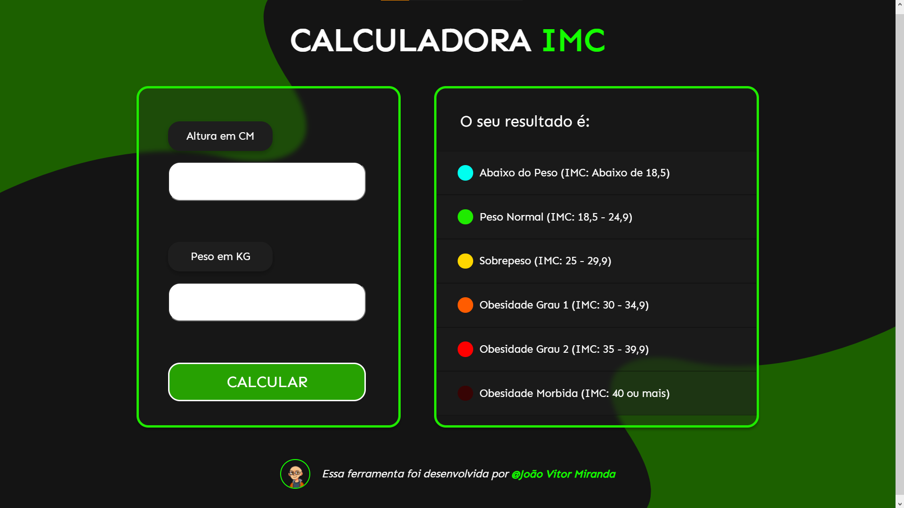

# BMI CALCULATOR (Responsive)

This repository contains the project files for a BMI Calculator (A calculator where you type your weight in Kilograms and you height in Centimeters and it shows if your on normal weight, over-weight or under-weight) This Page was made in Brazilian Portuguese.

## This project was done with:

* Figma for design
* Semantic HTML for Structure 
* CSS for Styling
* Flexbox Properties for Layout
* Media Queries for Responsiveness
* Javascript for calculation and user interation

## Screenshots

## Authors

- [Linkedin Profile (João Vitor Miranda)](https://www.linkedin.com/in/jo%C3%A3o-vitor-miranda-8b445222b)

